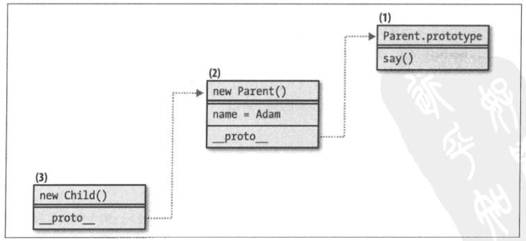
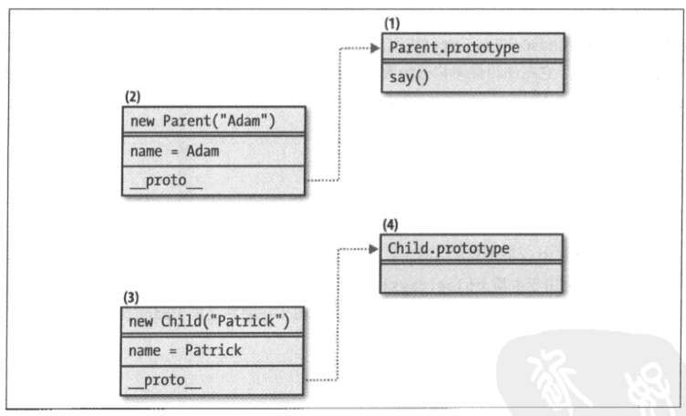
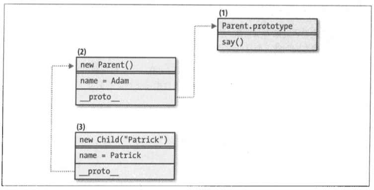
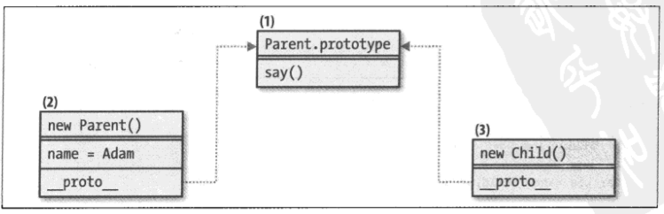
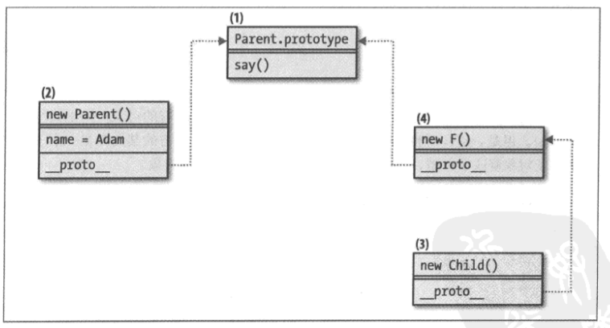

### P25. 如何避免eval()定义全局变量？

如：
``` javascript
var jsstring = "var un = 1;";
eval(jsstring);
console.log(typeof un);  // "number"
```

方法1：使用new Function()。new Function()中的代码将在局部函数空间中运行。
``` javascript
var jsstring = "var un2 = 1;";
new Function(jsstring)();
console.log(typeof un2);   // "undefined"
```

方法2：将eval()封装到一个即时函数中。
``` javascript
var jsstring = "var un3 = 1;";
(function() {
    eval(jsstring);
})()
console.log(typeof un3);   // "undefined"
```

---

### P26. eval()对作用域链的影响

- eval()会影响到作用域链，eval()可以访问和修改它外部作用域的变量。
- Function更类似于一个沙盒，无论哪里执行Function，它都仅仅能看到全局作用域，看不到外部作用域。

``` javascript
(function() {
    var local = 1;
    eval("local = 3; console.log(local); ");  // 3
    console.log(local);  // 3
})();

(function() {
    var local = 1;
    new Function("console.log(typeof local);")();  // undefined
})();
```

---

### P49. 自调用构造函数

作用：

- 调用构造函数时，及时没有使用new操作符，也可以正常工作。
- 使得原型属性可在对象实例中使用。

``` javascript
function Waffle() {
    if (!(this instanceof Waffle)) {    // 或者： if (!(this instanceof arguments.callee)) {
        return new Waffle();
    }
    this.tastes = "yummy";
}
Waffle.prototype.wantAnother = true;

// 测试调用
var first = new Waffle(),
    second = Waffle();

console.log(first.tastes);  // yummy
console.log(second.tastes);  // yummy
console.log(first.wantAnother);  // true
console.log(second.wantAnother);  // true
```

---

### P51. 数组构造函数的特殊性

- 向Array()构造函数传递单个数字时，它并不会成为第一个数组元素的值。相反，它设定了数组的长度，且每个元素都是undefined。
- 向Array()构造函数传递浮点数时，会引发RangeError。

``` javascript
var a = new Array(3);
console.log(a.length);  // 3
console.log(a[0]);  // undefined

var a = new Array(3.14);  // RangeError: invalid array length
console.log(typeof a);  // undefined;
```
使用Array()构造函数，返回一个具有255个空白字符的字符串：
``` javascript
var white = new Array(256).join(' ');
```

---

### P52. 检查数组的性质

ES5定义了Array.isArray()方法。或调用Object.prototype.toString()方法。
``` javascript
if (typeof Array.isArray() === 'undefined') {
    Array.isArray = function(arg) {
        return Object.prototype.toString.call(arg) === '[object Array]';
    }
}
```

---

### P70. 自定义函数/惰性函数定义

函数体内部，以一个新函数覆盖了旧函数，回收了旧函数指针以指向一个新函数。即，该函数以一个新的实现覆盖并重新定义了自身。

- 优点：适合旧函数有一些初始化准备工作要做，并且仅需执行一次。使用自定义函数模式，可以提升应用程序的性能。
- 缺点：
    - 重定义自身时，已经添加到原始函数的任何属性都会丢失。
    - 如果该函数使用了不同的名称，比如分配给不同的变量、以对象的方法来使用，那么重定义部分将永远不会发生，并且将会执行原始函数体。

``` javascript
var scareMe = function() {
    alert("Boo!");
    scareMe = function() {
        alert("Double boo!");
    }
}

// 使用自定义函数
scareMe();  // Boo!
scareMe();  // Double boo!
```

---

### P74. 即时函数

作用1：存储私有数据。即时函数可以返回函数，因此可以利用即时函数的作用域存储一些私有数据，而这特定于返回函数的内部函数。
``` javascript
var getResult = (function() {
    var res = 2+2;
    return function() {
        return res;
    }
})();
console.log(getResult());  // 4
```

作用2：定义对象属性。
``` javascript
var o = {
    message: (function() {
         var who = "me",
             what = "call";
         return what + " " + who;
    })(),
    getMsg: function() {
         return this.message;
     }
}

// 用法
console.log(o.getMsg());  // call me
console.log(o.message);  // call me
```

---

### P75. 即时对象初始化

使用带有init()方法的对象，该方法在创建对象后将会立即执行。init()函数负责所有的初始化任务。

优点：可以在执行一次初始化任务时保护全局命名空间。

这种模式主要适用于一次性任务，而且init()完毕后也没有对该对象的访问。如果想在init()完毕后保存对该对象的一个引用，可以在init()尾部添加return this
``` javascript
({
    max: 60,
    getMax: function() {
        return this.max;
    },

    // 初始化
    init: function() {
        console.log(this.getMax());  // 60
        // 更多初始化任务
    }
}).init();
```

---

### P78. 函数备忘

函数可以在任何时候将自定义属性添加在函数中。自定义属性的其中一个用例是缓存函数结果（即返回值），因此，在下一次调用该函数时就不用重做潜在的繁重计算。

可以为函数创建一个属性cache，该属性是一个对象，其中使用传递给函数的参数作为键，而计算结果作为值。计算结果可以是需要的任意复杂数据结构。对于有更多以及更复杂的参数，通用的解决方案是将它们序列化。例如，可以将参数对象序列化为一个JSON字符串，并使用该字符串作为cache对象的键。

``` javascript
var myFunc = function() {
    var cachekey = JSON.stringify(Array.prototype.slice.call(arguments)),
        result;

    if (!myFunc.cache[cachekey]) {
         result = {};
         // ``` 开销很大的操作```
         console.log('Do Job');
         myFunc.cache[cachekey] = result;
     }

    return myFunc.cache[cachekey];
}

// 缓存存储
myFunc.cache = {};

// 测试
myFunc(0);  // Do Job
myFunc(0);  // 无
```

---

### P85. 函数curry化/函数部分应用

``` javascript
function curry(fn) {
    var slice = Array.prototype.slice,
        stored_args = slice.call(arguments, 1);

    return function() {
         var new_args = slice.call(arguments),
             args = stored_args.concat(new_args);
         return fn.apply(null, args);
     }
}

// 普通函数
function add(a, b, c, d, e) {
    return a + b + c + d + e;
}

// 可运行于任意数量的参数
curry(add, 1, 2, 3)(5, 5);  // 16

// 两步curry化
var addOne = curry(add, 1);
addOne(10, 10, 10, 10);  // 41
var addSix = curry(addOne, 2, 3);
addSix(5, 5);  // 16
``` 

---

### P91. 命名空间函数

添加到命名空间的一些属性可能已经存在，这导致可能会覆盖它们。因此，在添加一个属性或者创建一个命名空间之前，最好是首先检查它是否已经存在：
``` javascript
if (typeof MYAPP === 'undefined') {
    var MYAPP = {};
}
// 或者：
var MYAPP = MYAPP || {};
```
可以定义一个处理命名空间细节的可重用的函数。这个实现是非破坏性的，也就是说，如果已经存在一个命名空间，便不会再重新创建它。
``` javascript
var MYAPP = MYAPP || {};
MYAPP.namespace = function(ns_string) {
    var parts = ns_string.split('.'),
        parent = MYAPP,
        i;

    // 剥离最前面的冗余全局变量
    if (parts[0] === "MYAPP") {
        parts = parts.slice(1);
    }

    for (i=0; i<parts.length; i++) {
        // 如果不存在，就创建一个属性
        parent[parts[i]] = parent[parts[i]] || {};
        parent = parent[parts[i]];
    }
    return parent;
}

// 测试
var module1 = MYAPP.namespace('MYAPP.modules.module1');
module1 === MYAPP.modules.module1;

// 忽略最前面的MYAPP
var module2 = MYAPP.namespace('modules.module2');
module2 === MYAPP.modules.module2;

// 长命名空间
MYAPP.namespace('one.two.three.four.five.six.seven.eight');

P93. 声明依赖

var myFunction() {
    // 依赖
    var event = YAHOO.util.Event,
          dom = YAHOO.util.Dom;
    // 使用事件和DOM变量
    // ...
}
```

---

### P94.对象的私有性

#### **构造函数的私有性**
构造函数创建一个闭包，而在闭包范围内部的任意变量都不会暴露给构造函数以外的代码。然而，这些私有变量仍然可以用于公共方法中，也称为特权方法。

``` javascript
function Gadget(){
    // 私有成员
    var name = 'iPod';
    // 公有函数或特权方法
    this.getName = function() {
        return name;
    }
}

// 测试
var toy = new Gadget();
console.log(toy.name)  // undefined
console.log(toy.getName());  // iPod
```
私有性失效：当直接从一个特权方法中返回一个私有变量，且该变量恰好是一个对象或者数组，那么外面的代码仍然可以访问该私有变量。因为这是通过引用传递的。
``` javascript
function Gadget() {
   // 私有成员
   var specs = {
       screen_width: 320,
       screen_height: 480,
       color: "white"
   };
   // 公有函数或特权方法
   this.getSpecs = function() {
       return specs;
   }
}

// 测试
var toy = new Gadget(),
    specs = toy.getSpecs();
specs.color = "black";
specs.price = "free";
console.dir(toy.getSpecs());
```
私有性失效的解决方法：

- 使getSpecs()返回一个新对象，该对象仅包含客户关注的原对象中的数据。即最低授权原则。

- 使用一个通用性的对象克隆函数，以创建specs对象的副本。如浅复制、深复制。

#### **对象字面量的私有性**
可以使用一个额外的匿名即时函数创建闭包来实现私有性。

方法1：
``` javascript
var myobj;
(function(){
    // 私有成员
    var name = "Peter";

    // 公有部分
    myobj = {
        // 特权方法
        getName: function() {
            return name;
        }
    }
})();

// 测试
console.log(myobj.name)  // undefined
console.log(myobj.getName());  // iPod
```

方法2：模块模式
``` javascript
var myobj = (function(){
    // 私有成员
    var name = "Peter";

    // 公有部分
    return {
        getName: function() {
            return name;
        }
    }
})();

// 测试
console.log(myobj.name)  // undefined
console.log(myobj.getName());  // iPod
```

#### **原型的私有性**
当私有成员与构造函数一起使用时，一个缺点在于每次调用构造函数以创建对象时，这些私有成员都会被重新创建。为了避免复制工作以节省内存，可以将常用属性和方法添加到构造函数的prototype属性中。这样，通过同一个构造函数创建的多个实例，可以共享常见的部分数据。

可以使用以下两个模式的组合：构造函数中的私有属性，以及对象字面量中的私有属性。由于prototype属性仅是一个对象，因此可以使用对象字面量创建该对象。
``` javascript
function Gadget() {
    // 私有成员
    var name = 'iPod';
    // 公有函数或特权方法
    this.getName = function() {
        return name;
    }
}

Gadget.prototype = (function() {
    // 私有成员
    var browser = "Mobile Webkit";
    // 公有原型成员
    return {
        getBrowser: function() {
            return browser;
        }
    }
})();

// 测试
var toy = new Gadget();
console.log(toy.getName());  // iPod
console.log(toy.getBrowser());  // Mobile Webkit
```

---

### P99. 模块模式

模块模式是以下模式的组合：

- 命名空间
- 即时函数
- 私有和特权成员
- 声明依赖

方法1：返回对象
``` javascript
MYAPP.namespace('MYAPP.utilities.array');
MYAPP.utilities.array = (function() {
    // 依赖
    var uobj = MYAPP.utilities.object,
        ulang = MYAPP.utilities.lang,

    // 私有属性
        array_string = "[object Array]",
        ops = Object.prototype.toString;

    // 私有方法
    // ...

    // 可选的一次性初始化过程
    console.log('Creating namespace: array');

    // 公有API
    return {
        isArray: function(a) {
            return ops.call(a) === array_string;
        }
        // ...更多方法和属性
    }
})();
```

方法2：返回构造函数
``` javascript
MYAPP.namespace('MYAPP.utilities.array');
MYAPP.utilities.array = (function(){
    // 依赖
    var uobj = MYAPP.utilities.object,
        ulang = MYAPP.utilities.lang,

    // 私有属性和方法
       Constr;

    // 可选的一次性初始化过程
    console.log('Creating namespace: array');

    // 公有API——构造函数
    Constr = function(o) {
        this.elements = this.toArray(o);
    };

    // 公有API——原型
    Constr.prototype = {
        constructor: MYAPP.utiltities.array,
        version: "2.0",
        toArray: function(obj) {
           for (var i=0, a=[], len=obj.length; i<len; i++) {
               a[i] = obj[i];
            }
            return a;
        }
    }

    // 返回新的构造函数
    return Constr;
})();

// 测试
var arr = new MYAPP.utilities.array(obj);
```

---

### P108. 静态成员

静态属性和方法，是指从一个实例到另一个实例都不会发生改变的属性和方法。
静态成员的优点：可以包含非实例相关的方法和属性，并且不会为每个实例重新创建静态属性。

#### **公有静态成员**
可以使用构造函数，并且向其添加属性这种方式。静态成员，不需要特定的对象就能够运行。同时为了使实例对象也可以调用静态成员，只需要向原型中添加一个新的成员即可，其中该新成员作为一个指向原始静态成员的外观。
``` javascript
// 构造函数
var Gadget = function() {};

// 静态方法
Gadget.isShiny = function() {
    return 'you bet';
};
// 向原型中添加一个普通方法
Gadget.prototype.setPrice = function(price) {
    this.price = price;
}
// 向原型中添加一个外观
Gadget.prototype.isShiny = Gadget.isShiny;

// 测试
// 调用静态方法
Gadget.isShiny();  // you bet;

// 实例调用普通方法
var iphone = new Gadget();
iphone.setPrice(500);

// 实例调用静态方法
iphone.isShiny();  // you bet
```
#### **私有静态成员**
私有静态成员具有如下属性：

- 以同一个构造函数创建的所有对象，共享该成员。
- 构造函数外部不可访问该成员。

实现方法：闭包+即时函数。可参考模块模式的返回构造函数。
``` javascript
// 构造函数
var Gadget = (function() {
    // 静态变量
    var counter = 0,
        NewGadget;

    // 新的构造函数的实现
    NewGadget = function() {
        counter ++;
    };

    // 特权方法
    NewGadget.prototype.getLastId = function() {
        return counter;
    };

    // 覆盖该构造函数
    return NewGadget;

})();

// 测试
var iphone = new Gadget();
console.log(iphone.getLastId());
var ipod = new Gadget();
console.log(ipod.getLastId());
var ipad = new Gadget();
console.log(ipad.getLastId());
``` 

---

### P115. method()方法

作用：向构造函数的原型中添加新方法。
``` javascript
if (typeof Function.prototype.method !== "function") {
    Function.prototype.method = function(name, implementation) {
        this.prototype[name] = implementation;
        return this;    // 返回this（指向构造函数），支持链式调用
    }
}

// 测试
// 构造函数
var Person = function(name) {
    this.name = name;
}.
    method('getName', function() {
        return this.name;
    }).
    method('setName', function(name) {
        this.name = name;
        return this;
    });

// 对象
var a = new Person('Adam');
a.getName();  // Adam;
a.setName('Eve').getName();  // Eve
```

---

### P119. 继承模式1——设置原型（默认模式）

实现方式：
``` javascript
// 父构造函数
function Parent(name) {
    this.name = name || 'Adam';
}

// 向原型中添加方法
Parent.prototype.say = function() {
    return this.name;
}

// 子构造函数（空白）
function Child(name) {}

// 继承：设置原型
Child.prototype = new Parent();

// 测试
var kid = new Child();
kid.say();  // Adam
```

原型链：


注意：

- ` __proto__`属性仅用来解释原型链，不可用于开发中。
- 若子对象#3定义属性name，并不会修改父对象#2的name属性，而是直接在子对象#3上创建一个自身属性。如果使用delete删除子对象#3的name属性，那么父对象#2的name属性将表现出来。
- 优点：
    - 子对象继承了：父构造函数中的this属性、父原型中的属性。
- 缺点：
    - 不支持将参数传递到子构造函数中，而子构造函数然后又将参数传递到父构造函数中。
    - 如果父类构造函数中的this属性为引用类型，可能存在子对象意外覆盖父对象属性的风险。

``` javascript
// 演示缺点1

var s = new Child('Seth');
s.say();  // Adam
```

``` javascript
// 演示缺点2

// 父构造函数
function Article() {
    this.tags = ['js', 'css'];
}
var article = new Article();

// 子构造函数及继承
function Blog() {}
Blog.prototype = article;

// 子对象意外修改父对象的引用属性
var blog = new Blog();
blog.tags.push('html');
console.log(article.tags.join(' '));  // js css html
```

---

### P122. 继承模式2——借用构造函数

实现方式：
``` javascript
// 父构造函数
function Parent(name) {
    this.name = name || 'Adam';
}

// 向原型中添加方法
Parent.prototype.say = function() {
    return this.name;
}

// 子构造函数
function Child(name) {
    // 继承：借用构造函数
    Parent.apply(this, arguments);
}

// 测试
var kid = new Child('Partrick');
kid.name;  // Partick
typeof kid.say;  // undefined
```

原型链：


注意：

- 缺点：只能继承父构造函数中的this属性，不能继承父原型中的属性。
- 优点：
    - 本模式解决了从子构造函数到父构造函数的参数传递问题。
    - 子对象可以获得父对象自身成员的副本（而非引用），并且不会存在子对象意外覆盖父对象属性的风险。

---

### P125. 继承模式3——设置原型&借用构造函数

实现方式：
``` javascript
// 父构造函数
function Parent(name) {
    this.name = name || 'Adam';
}

// 向原型中添加方法
Parent.prototype.say = function() {
    return this.name;
}

// 子构造函数
function Child(name) {
    // 继承：借用构造函数
    Parent.apply(this, arguments);
}

// 继承：设置原型
Child.prototype = new Parent();

// 测试
var kid = new Child('Partrick');
kid.name;  // Partick
kid.say();  // Partick
delete kid.name;
kid.say();  // Adam
```

原型链：


注意：

- 优点：
    - 能够获得父对象自身成员的副本。子对象可以安全地修改自身属性，且不会带来修改其父对象的风险。
    - 子对象继承了：父构造函数中的this属性、父原型中的属性。
    - 子构造函数可将任意参数传递到父构造函数中。
- 缺点：
    - 父构造函数被调用了两次，导致其效率低下。自身的属性（name）被继承了两次，删除了子类本身的name属性的副本后，原型链上的name属性将表现出来。

---

### P126. 继承模式4——共享原型

实现方式：
``` javascript
// 父构造函数
function Parent(name) {
    this.name = name || 'Adam';
}

// 向原型中添加方法
Parent.prototype.say = function() {
    return this.name;
}

// 子构造函数
function Child() {}

// 继承：共享原型
child.prototype = Parent.prototype;
```

原型链：


注意：

- 本模式适用于：可复用成员应转移到原型中，而不是放置在父类this中。任何值得继承的东西都应该放置在原型中实现。
- 不能继承父构造函数中的this属性，只能继承父原型中的属性。
- 缺点：
    - 如果在继承链下方的某处存在一个子对象或孙子对象修改了原型，将会影响到所有父对象和祖先对象。

---

### P128. 继承模式5——临时构造函数

实现方式：
``` javascript
// 父构造函数
function Parent(name) {
    this.name = name || 'Adam';
}

// 向原型中添加方法
Parent.prototype.say = function() {
    return this.name;
}

// 子构造函数
function Child(name) {}

// 继承：设置原型
inherit(Child, Parent);

// 实现：
function inherit(C, P) {
    var F = function() {};
    F.prototype = P.prototype;
    C.prototype = new F();
    C.prototype.constructor = C;
}

// 优化：避免在每次需要继承时，都创建临时（代理）构造函数。
// 实现：即时函数+闭包
var inherit2 = (function() {
    var F = function() {};
    return function(C, P) {
        F.prototype = P.prototype;
        C.prototype = new F();
        C.prototype.constructor = C;
    }
})();

// 测试
var kid = new Child();
kid.say();  // undefined
kid.name = "Peter";
kid.say();  // Peter
```

原型链：


注意：

- 子对象仅继承了原型的属性。原型仅用来放置可复用的功能。父构造函数的this中的任何成员都不会被继承。
- 需要重置子构造函数的指针：C.prototype.constructor = C

---

### P133. 继承模式6——原型继承

实现方式：
``` javascript
function object(P) {
    var F = function() {};
    F.prototype = P;
    return new F();
}
```
对象字面量方式创建父对象
``` javascript
var parent = {
    name: "papa"
}
var child = object(parent);

// 测试
console.log(child.name);
```
构造函数方式创建父对象
``` javascript
// 父构造函数
function Parent() {
    this.name = "papa";
}
Parent.prototype.getName = function() {
    return this.name;
}

// 创建一个父对象
var papa = new Parent();

// 继承方式1：父构造函数中的this属性、父原型的属性都被继承
var kid = object(papa);
console.log(typeof kid.name);  // string
console.log(typeof kid.getName);  // function

// 继承方式2：仅继承父原型的属性
var kid = object(Parent.prototype);
console.log(typeof kid.name);  // undefined
console.log(typeof kid.getName);  // function
```
ES5: Object.create()

---

### P136. 继承模式7——复制属性

#### **浅复制**
在使用浅复制时，如果改变了子对象的属性，并且该属性恰好是一个对象，那么这种操作也将修改父对象。
``` javascript
function extend(parent, child) {
    var i;
    child = child || {};
    for (i in parent) {
        if (parent.hasOwnProperty(i)) {
            child[i] = parent[i];
        }
    }
    return child;
}

// 测试
var dad = {
    counts: [1, 2, 3],
    reads: { paper: true }
};
var kid = extend(dad);
kid.counts.push(4);
dad.counts.toString();  // 1,2,3,4
dad.reads === kid.reads;  // true
```

#### **深复制**
检查父对象的某个属性是否为对象，如果是，则需要递归复制出该对象的属性。
``` javascript
function extendDeep(parent, child) {
    var i,
          toStr = Object.prototype.toString,
          astr = "[object Array]";
    child = child || {};

    for (i in parent) {
        if (parent.hasOwnProperty(i)) {
            if (typeof parent[i] === 'object') {
                child[i] = (toStr.call(parent[i]) === astr) ? [] : {};
                extendDeep(parent[i], child[i]);
            } else {
                child[i] = parent[i];
            }
        }
    }
    return child;
}

// 测试
var dad = {
    counts: [1, 2, 3],
    reads: { paper: true }
};
var kid = extendDeep(dad);
kid.counts.push(4);
dad.counts.toString();  // 1,2,3
dad.reads === kid.reads;  // false
```

#### **混入**
从多个对象中复制出任意成员，并将这些成员组合成一个新的对象。
遇到同名属性，总是使用靠后对象的值，即越往后优先级越高。
``` javascript
function mix() {
    var i, prop, child = {};
    for (i = 0; i<arguments.length; i++) {
        for (prop in arguments[i]) {
            if (arguments[i].hasOwnProperty(prop)) {
                child[prop] = arguments[i][prop];
            }
        }
    }
    return child;
}

// 测试
var cake = mix(
    { eggs: 2, large: true },
    { buter: 1, saleted: true },
    { flour: "3 cups" },
    { sugar: "sure!" },
    { eggs: 3 }  // 同名属性，越往后优先级越高
);
console.dir(cake);
```

---

### P141. 绑定
``` javascript
function bind(obj, fn) {
    return function() {
        return fn.apply(obj, Array.prototype.slice.call(arguments));
    };
}
```
ES5: Funtion.prototype.bind()
``` javascript
if (typeof Function.prototype.bind === 'undefined') {
    Function.prototype.bind = function(obj) {
        var fn = this,
            slice = Array.prototype.slice,
            args = slice.call(arguments, 1);

        return function() {
            return fn.apply(obj, args.concat(slice.call(arguments)));
        } ;
    };
}
```

---

### P204. 延迟加载
``` javascript
function lazyload(file) {
    var script = document.createElement("script");
    script.src = file;
    document.getElementsByTagName("head")[0].appenChild(script);
}

// 使用
window.onload = function() {
    lazyload('extra.js');
}
```

---

### P205. 按需加载
``` javascript
function require(file, callback){
 　　var script = document.createElement ("script");
 　　script.type = "text/javascript";
 　　if (script.readyState){ //IE
 　　　　script.onreadystatechange = function(){
 　　　　　　if (script.readyState === "loaded" || script.readyState === "complete"){
 　　　　　　　　script.onreadystatechange = null;
 　　　　　　　　callback();
 　　　　　　}
 　　　　};
 　　} else { //Others
 　　　　script.onload = function(){
 　　　　　　callback();
 　　　　};
 　　}
　　script.src = file;
 　  document.getElementsByTagName("head")[0].appendChild(script);
}

// 使用
require("extra.js", function() {
    // 执行extra.js中定义的函数
});
```

---

### P207. 预加载

- IE下使用图像灯塔模式方法请求。
- 其他浏览器中，使用`<object>`来代替脚本元素，并向其data属性指向脚本的URL。

``` javascript
var preload;
if (/*@cc_on!@*/false) {  // 使用条件注释的IE嗅探
    preload = function(file) {
        new Image().src = file;
    };
} else {
    preload = function(file) {
        var obj = document.createElement('object');
        obj.width = 0;
        obj.height = 0;
        obj.data = file;
        document.body.appendChild(obj);
    };
}

// 使用：
preload('extra.js');
```