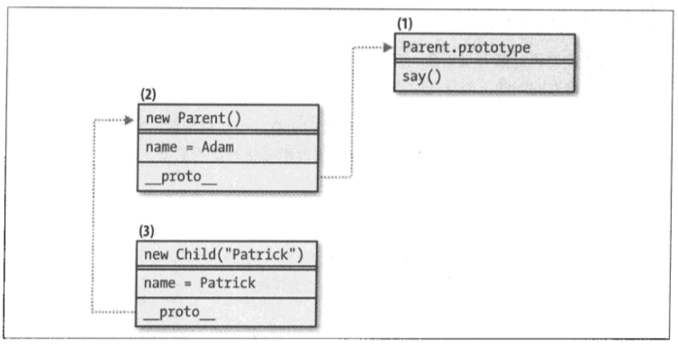
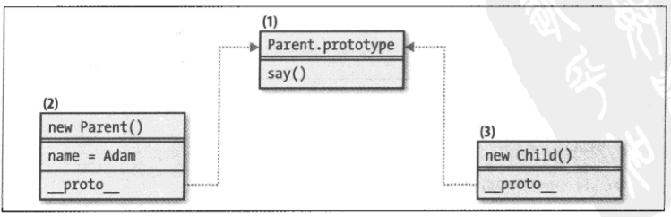
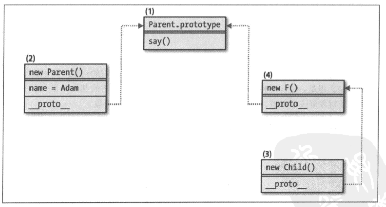

《JavaScript模式》一书中，对于JavaScript的几种继承模式讲解得很清楚，给我提供了很大帮助。总结一下，有如下7种模式。

### 继承模式1——设置原型（默认模式）

实现方式：

```javascript
// 父构造函数
function Parent(name) {
    this.name = name || 'Adam';
}

// 向原型中添加方法
Parent.prototype.say = function() {
    return this.name;
}

// 子构造函数（空白）
function Child(name) {}

// 继承：设置原型
Child.prototype = new Parent();

// 测试
var kid = new Child();
kid.say();  // Adam
```

原型链：


注意：

- `__proto__`属性仅用来解释原型链，不可用于开发中。
- 若子对象#3定义属性name，并不会修改父对象#2的name属性，而是直接在子对象#3上创建一个自身属性。如果使用delete删除子对象#3的name属性，那么父对象#2的name属性将表现出来。
- 优点：
    - 子对象继承了：父构造函数中的this属性、父原型中的属性。
- 缺点：
    - 不支持将参数传递到子构造函数中，而子构造函数然后又将参数传递到父构造函数中。
    - 如果父类构造函数中的this属性为引用类型，可能存在子对象意外覆盖父对象属性的风险。

```javascript
// 演示缺点1

var s = new Child('Seth');
s.say();  // Adam
```

```javascript
// 演示缺点2

// 父构造函数
function Article() {
    this.tags = ['js', 'css'];
}
var article = new Article();

// 子构造函数及继承
function Blog() {}
Blog.prototype = article;

// 子对象意外修改父对象的引用属性
var blog = new Blog();
blog.tags.push('html');
console.log(article.tags.join(' '));  // js css html
```

---

### 继承模式2——借用构造函数

实现方式：

```javascript
// 父构造函数
function Parent(name) {
    this.name = name || 'Adam';
}

// 向原型中添加方法
Parent.prototype.say = function() {
    return this.name;
}

// 子构造函数
function Child(name) {
    // 继承：借用构造函数
    Parent.apply(this, arguments);
}

// 测试
var kid = new Child('Partrick');
kid.name;  // Partick
typeof kid.say;  // undefined
```

原型链：


注意：

- 缺点：只能继承父构造函数中的this属性，不能继承父原型中的属性。
- 优点：
    - 本模式解决了从子构造函数到父构造函数的参数传递问题。
    - 子对象可以获得父对象自身成员的副本（而非引用），并且不会存在子对象意外覆盖父对象属性的风险。

---

### 继承模式3——设置原型&借用构造函数

实现方式：

```javascript
// 父构造函数
function Parent(name) {
    this.name = name || 'Adam';
}

// 向原型中添加方法
Parent.prototype.say = function() {
    return this.name;
}

// 子构造函数
function Child(name) {
    // 继承：借用构造函数
    Parent.apply(this, arguments);
}

// 继承：设置原型
Child.prototype = new Parent();

// 测试
var kid = new Child('Partrick');
kid.name;  // Partick
kid.say();  // Partick
delete kid.name;
kid.say();  // Adam
```

原型链：



注意：

- 优点：
    - 能够获得父对象自身成员的副本。子对象可以安全地修改自身属性，且不会带来修改其父对象的风险。
    - 子对象继承了：父构造函数中的this属性、父原型中的属性。
    - 子构造函数可将任意参数传递到父构造函数中。
- 缺点：
    - 父构造函数被调用了两次，导致其效率低下。自身的属性（name）被继承了两次，删除了子类本身的name属性的副本后，原型链上的name属性将表现出来。

---

### 继承模式4——共享原型

实现方式：

```javascript
// 父构造函数
function Parent(name) {
    this.name = name || 'Adam';
}

// 向原型中添加方法
Parent.prototype.say = function() {
    return this.name;
}

// 子构造函数
function Child() {}

// 继承：共享原型
child.prototype = Parent.prototype;
```

原型链：



注意：

- 本模式适用于：可复用成员应转移到原型中，而不是放置在父类this中。任何值得继承的东西都应该放置在原型中实现。
- 不能继承父构造函数中的this属性，只能继承父原型中的属性。
- 缺点：
    - 如果在继承链下方的某处存在一个子对象或孙子对象修改了原型，将会影响到所有父对象和祖先对象。

---

### 继承模式5——临时构造函数

实现方式：

```javascript
// 父构造函数
function Parent(name) {
    this.name = name || 'Adam';
}

// 向原型中添加方法
Parent.prototype.say = function() {
    return this.name;
}

// 子构造函数
function Child(name) {}

// 继承：设置原型
inherit(Child, Parent);

// 实现：
function inherit(C, P) {
    var F = function() {};
    F.prototype = P.prototype;
    C.prototype = new F();
    C.prototype.constructor = C;
}

// 优化：避免在每次需要继承时，都创建临时（代理）构造函数。
// 实现：即时函数+闭包
var inherit2 = (function() {
    var F = function() {};
    return function(C, P) {
        F.prototype = P.prototype;
        C.prototype = new F();
        C.prototype.constructor = C;
    }
})();

// 测试
var kid = new Child();
kid.say();  // undefined
kid.name = "Peter";
kid.say();  // Peter
```

原型链：



注意：

- 子对象仅继承了原型的属性。原型仅用来放置可复用的功能。父构造函数的this中的任何成员都不会被继承。
- 需要重置子构造函数的指针：`C.prototype.constructor = C`

---

### 继承模式6——原型继承

实现方式：

```javascript
function object(P) {
    var F = function() {};
    F.prototype = P;
    return new F();
}
```

#### 对象字面量方式创建父对象

```javascript
var parent = {
    name: "papa"
}
var child = object(parent);

// 测试
console.log(child.name);
```

#### 构造函数方式创建父对象

```javascript
// 父构造函数
function Parent() {
    this.name = "papa";
}
Parent.prototype.getName = function() {
    return this.name;
}

// 创建一个父对象
var papa = new Parent();

// 继承方式1：父构造函数中的this属性、父原型的属性都被继承
var kid = object(papa);
console.log(typeof kid.name);  // string
console.log(typeof kid.getName);  // function

// 继承方式2：仅继承父原型的属性
var kid = object(Parent.prototype);
console.log(typeof kid.name);  // undefined
console.log(typeof kid.getName);  // function
```

ES5: `Object.create()`

---

### 继承模式7——复制属性

#### 浅复制
在使用浅复制时，如果改变了子对象的属性，并且该属性恰好是一个对象，那么这种操作也将修改父对象。

```javascript
function extend(parent, child) {
    var i;
    child = child || {};
    for (i in parent) {
        if (parent.hasOwnProperty(i)) {
            child[i] = parent[i];
        }
    }
    return child;
}

// 测试
var dad = {
    counts: [1, 2, 3],
    reads: { paper: true }
};
var kid = extend(dad);
kid.counts.push(4);
dad.counts.toString();  // 1,2,3,4
dad.reads === kid.reads;  // true
```

#### 深复制
检查父对象的某个属性是否为对象，如果是，则需要递归复制出该对象的属性。

```javascript
function extendDeep(parent, child) {
    var i,
          toStr = Object.prototype.toString,
          astr = "[object Array]";
    child = child || {};

    for (i in parent) {
        if (parent.hasOwnProperty(i)) {
            if (typeof parent[i] === 'object') {
                 child[i] = (toStr.call(parent[i]) === astr) ? [] : {};
                 extendDeep(parent[i], child[i]);
            } else {
                 child[i] = parent[i];

            }
        }
    }
    return child;
}

// 测试
var dad = {
    counts: [1, 2, 3],
    reads: { paper: true }
};
var kid = extendDeep(dad);
kid.counts.push(4);
dad.counts.toString();  // 1,2,3
dad.reads === kid.reads;  // false
```

#### 混入
从多个对象中复制出任意成员，并将这些成员组合成一个新的对象。
遇到同名属性，总是使用靠后对象的值，即越往后优先级越高。

```javascript
function mix() {
    var i, prop, child = {};
    for (i = 0; i<arguments.length; i++) {
        for (prop in arguments[i]) {
            if (arguments[i].hasOwnProperty(prop)) {
                child[prop] = arguments[i][prop];

            }
        }
    }
    return child;
}

// 测试
var cake = mix(
    { eggs: 2, large: true },
    { buter: 1, saleted: true },
    { flour: "3 cups" },
    { sugar: "sure!" },
    { eggs: 3 }  // 同名属性，越往后优先级越高
);
console.dir(cake);
```
