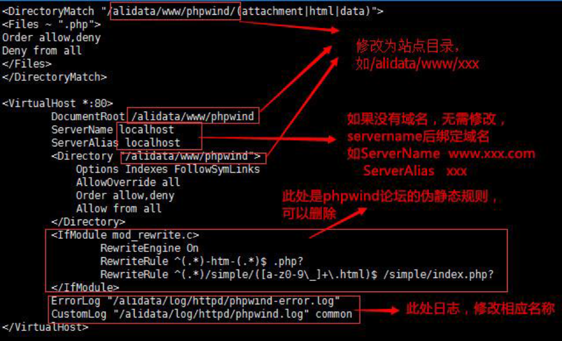
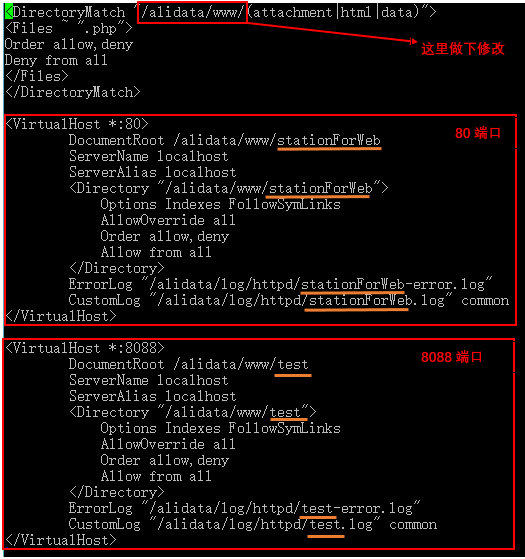

有一个小笑话：  
> 从前有个程序员遇到了一个问题。他想，没事，我懂，用线程就好了。现他有两个问题了。  

本人小白，对网站部署什么都不懂，只是申请个[阿里云服务器](https://www.aliyun.com/product/ecs?spm=5176.8112568.416540.25.h74Wkp)，把我的站点放上去。于是，铺天盖地的问题随之而来。现在总结一下流程，供同样的小白参考。

## 申请阿里云服务器  
### 1.购买服务器  
建站呢首先要有一个服务器。可以购买一个**阿里云服务器**，[学生认证](https://www.aliyun.com/act/aliyun/campus.html)后，首月只需10元费用，可以用来练习建站。由于学生身份，申请服务器时很多配置都是不可以更改的，如`CPU`、`内存`、`带宽`、`磁盘`。但是可以自己选操作系统，可选的有`Windows`、`CentOS`、`Unbuntu`。我申请的是申请**Ubuntu 14.04**作为平台。  
### 2.登陆到管理控制台  
申请成功后，可以登录到阿里云的`管理控制台`，通过左侧`产品与服务->云服务器ECS`管理服务器。第一次管理时，会让你设置`快照`规则，如果不懂可以跳过该步骤，接下来会讲解。
### 3.实例
`实例`就是指你从阿里云买了多少台服务器。刚刚只买了一台Ubuntu，所以只有一个实例。如果以后有钱了，买了好多台，可以通过`实例`统一管理。
### 4.磁盘
`磁盘`很好理解。刚申请的学生服务器，只能选择40G普通云盘。Ubuntu就住在这块磁盘上。
### 5.快照
`快照`简单理解，就是磁盘备份。阿里帮你定期将磁盘备份，你可以在`自动快照策略`中设置每隔多久备份一次，备份哪个磁盘。可以在`快照列表`中看到已经备份的磁盘镜像。`快照`目前是免费的，不用白不用。
### 6.其他选项
`镜像`、`安全组`我也不知道是什么鬼。`标签管理`没用过。`操作日志`顾名思义。
### 7.实例管理
当然，我们的目的是建站，所以`实例->管理`才是最重要的。在`实例->更多`中可以关机、重启、改密码等。进入`实例->管理`后，`实例详情`允许我们修改实例名称、密码，查看Ubuntu的硬件、IP等。下方的`本实例磁盘`、`快照`、`安全组`、`安全防护`一看就明白。

---

## 管理我的Ubuntu
### 1.用户名和密码
管理Ubuntu，一定要知道用户名和密码。用户名默认是`root`，不需要改。密码建议你起一个好记的，修改方式为`基本信息->更多->重置密码`，经手机验证后即可，假设密码`Zhangsan123`。修改密码后，需重启Ubuntu才生效。
### 2.两种方式
`实例详情`允许我们以两种方式管理Ubuntu: `连接管理终端`和`SSH`。
#### 连接管理终端
> - `连接管理终端`，通过网页即可进入Ubuntu命令行。
> - 首次点击`连接管理终端`，会弹出一个6位数密码，该密码只用于从网页管理Ubuntu，也可以修改，如`123456`。
> - 然后在`输入管理终端密码`中输入密码`123456`，即可进入命令行。
> - 进入命令行后，以用户名`root`、密码`Zhangsan123`进行验证。通过后即弹出欢迎界面。

用`连接管理终端`方便快捷，但是显得不够专业。于是**SSH满足了我们装逼的需求**。
 
#### SSH
> - 我的电脑是Windows，可以下载`Putty`或`Secure Shell Client`。如果你是Mac或Linux用户，可参考`基本信息->更多->连接帮助`。
> - 用SSH登陆，还需一个IP地址，这个IP就是`配置信息->公网IP`，也可通过`基本信息->更多->连接帮助`查询。
> - OK，现在有了用户名`root`、密码`Zhangsan123`、IP地址，就可以利用SSH装逼了。我强力推荐`Secure Shell Client`，因为它附带`File Transfer`，可以很方便地使本地Windows与Ubuntu进行文件互动，比如上传、下载、删除。后续我就会用到`File Transfer`。

### 3.准备部署
我们申请到的服务器，是一个空白的Linux。不搭建好经典的`LAMP`，别人是访问不到我们的站点的。

---

## 阿里一键安装Web环境
### 1.下载一键安装包
自己部署Web环境，对小白来说真是如噩梦一般。阿里工程师就为我们提供了傻瓜式`一键安装包`。这是[官方说明](
https://help.aliyun.com/document_detail/43244.html?spm=5176.product25365.4.19.ztYMkQ)，这是另一个比较好的[教程](
http://www.cnblogs.com/smyhvae/p/4965163.html)。
> - 这个安装包是收费的，人民币2元。我不会告诉你，在上面这个教程中，可以下载到。其实我用的就是这位前辈分享的资源。
> - 使用这个安装包，会自动卸载以前装过的mysql、apache等，所以要先备份。
> - 如果已经安装过一次一键安装包，再次安装时会清理之前一键安装包安装过的环境，所以要备份`/alidata`目录。

### 2.上传安装包到Ubuntu  
在Windows上，将`一键安装包`解压缩后，用`File Transfer`将`sh-1.4.4`文件夹上传到Ubuntu的`/root`下。官方推荐用`xshell+Xftp`，我认为`Secure Shell Client`及其`File Transfer`完全可以胜任。
### 3.Ubuntu上运行安装包
使用`连接管理终端`或`SSH`登入到命令行后，依次执行：
 
```linux 
cd /root
chmod –R 777 sh-1.4.4
cd sh-1.4.4
./install.sh
```
### 4.选择版本
接下来选择要LAMP（*Linux+Apache+MySQL+PHP*）中AMP版本。命令行中会给出提示，让你用数字表示你的选择。这里选：
> - apache服务器`数字2`
> - apache版本2.4.20`数字2`
> - php版本5.5.7`数字3`
> - mysql版本5.5.40`数字2`
### 5.发呆
大约半个小时安装完毕。
> - 可以用`netstat –tunpl`检查一下运行状态的服务及端口。
> - 也可以`cat /alidata/website-info.log`查看刚才安装软件的版本信息。
> - 与你网站所有相关的东西，都在`/alidata`这个文件夹下。
### 6.修改mysql密码
用安装工具安装的mqsql及ftp，会使用保存在`acount.log`中的默认密码，可通过`cat /root/sh-1.4.4/acount.log`查看。这个密码并不友好，可以通过如下命令修改：  

```linux
	mysqladmin –uroot –p旧密码 password 新密码
```
> - -u和root之间没有空格
> - -p和旧密码之间没有空格
> - password和新密码之间有空格。

比如把新密码也改为root，方便记忆：

```linux
	mysqladmin –uroot –p9ad0cd53c9 password root
```
### 7.远程管理mysql
这里介绍`phpMyAdmin`和`MySQL-Front`
> - **phpMyAdmin**
> 一键安装包已经为我们下载好了`phpMyAdmin`，就在`/alidata/www/phpwind`下。在浏览器输入`http://公网IP/phpmyadmin`，就可以访问`phpMyAdmin`了。

> - **MySQL-Front**
> > - 要让你的Windows有权访问mysql。进入mysql，看看谁有权限访问mysql
``` linux
	use mysql;
	select user,host from user;
```
> > - 很不幸，默认情况下别人都没有权限。
> > - 接下来为我的windows赋予这样的权限：
```linux
	grant all privileges on *.* to "root"@"%" identified by "mysql密码";
	flush privileges; 
```
> > - 再执行`select user,host from user;`就可以看见，你的Windows已经有权限了。
> > - 接下来打开`MySQL-Front`，简单配置一下即可使用了。

### 8.完成
至此，已经完成Web环境的搭建。

---

## 搭建Web站点
### 1.上传站点
用`File Transfer`把站点目录XXX(如stationForWeb)上传到`/alidata/www/phpwind`目录下，即可通过`http://公网IP/XXX`访问自己的站点了。
### 2.修改配置
`一键安装包`的默认站点目录是`/alidata/www/phpwind`，所以通过`http://公网IP`访问服务器时，总是进入了`phpwind`这个自带的网站。如果希望进入自己创建的站点，可以：
> - 将XXX上传到`/alidata/www/`下，即与`phpwind`平级。并修改目录所属的组:
```linux
    cd /alidata/www/
    chown .www /alidata/www/XXX -R
```
> - 修改apache的虚拟主机配置文件，默认情况下只有一个`phpwind.conf`文件。先将它替换为`XXX.conf`：
```
	cd /alidata/server/httpd/conf/vhosts/
	mv phpwind.conf XXX.conf
```
> - 用`vim`修改`XXX.conf`内容为：

> - 重启Apache服务：`/etc/init.d/httpd restart`
> - 之后，通过`http://公网IP`访问时，就会进入自己的站点了。

### 3.删除phpwind
`phpwind`这个网站是一键安装包自带的，没有用，删了也无妨。在删除前，要把`phpMyAdmin`目录转移到XXX目录下，否则`phpMyAdmin`将无法使用。

```linux
	cd /alidata/www
	mv phpwind/phpmyadmin XXX
	rm –r phpwind
```
### 4.发布多个站点
如果我想发布多个站点，比如说想多加个test。则把test站点的文件夹，复制到`/alidata/www/XXX`下即可。可问题是，XXX是一个站点，test是另一个站点，二者没有任何关系。把test的文件夹复制到XXX下，并不符合逻辑，也不容易维护。  

如果我想使每个站点都保持独立性，即在`/alidata/www`各每个站点有自己的文件夹，可以利用公网IP的不同端口。除了80外，还可选88、8011、8088、8888等等。
> - 修改配置文件`httpd.conf`，监听多个端口
```linux
	cd /alidata/server/httpd/conf/
	vim httpd.conf
```
> - 找到Listen 80，在下面加一行Listen 8088
> - 修改虚拟主机的配置文件，即之前的`XXX.conf`。我- 将它取个更合适的名字，比如`httpd-vhosts.conf`。
```linux
	mv XXX.conf httpd-vhosts.conf
	vim httpd-vhosts.conf
```
> - 添加一个监听8088的虚拟主机

> - 重启http服务:`/etc/init.d/httpd restart`
> - 把test文件夹上传到`/alidata/www`下，通过`http://公网IP:8088`就可以访问了。

---

## 网站部署步骤总结
> - 复制sh-1.4.4到/root下，改为777权限，执行./install.sh，选择版本安装。
> - `可选`修改mysql的密码。
> - `可选`如果想使用MySQL -Front，需进入mysql命令行，获取权限。
> -  上传站点目录到www。
> -  `可选`修改/alidata/server/httpd/conf/httpd.conf，添加监听的端口
> - 修改/alidata/server/httpd/conf/vhosts/phpwind.conf，重命名为httpd-vhosts.conf，修改里面的目录名、日志名。多端口的话需添加Virtual Host
> - 重启http服务。
> - `可选`将phpMyAdmin导出到站点目录下，删除phpWind目录。