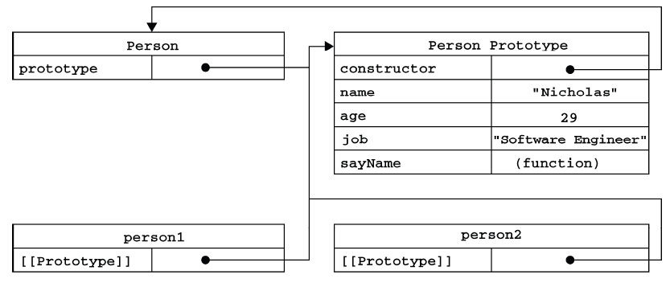

### 构造函数模式

##### 实现方式：

```javascript
function Person(name, age, job) {
    this.name = name;
    this.age = age;
    this.job = job;
    this.sayName = function() {
        return this.name
    }
}

// 测试
var person = new Person('Nicholas', 29, 'Engineer');

// 检测对象类型
console.log(person.constructor === Person);  // true
console.log(person instanceof Person);  // true
console.log(Person instanceof Object);  // true
```

##### 注意：

- 构造函数名使用首字母大写。
- 使用`new操作符`创建实例。
- 优点：
    - 可以使用`instanceof操作符`检测对象类型。
- 缺点：
    - 每个方法都要在每个实例上重新创建一遍。不同实例的同名函数不相等。

```javascript
var person1 = new Person('Nicholas', 29, 'Engineer');
var person2 = new Person('Greg', 30, 'Doctor');
console.log(person1.sayName === person2.sayName);  // false
```

---

### 原型模式

##### 实现方式:

```javascript
function Person() {}
Person.prototype.name = "Nicholas";
Person.prototype.age = 29;
Person.prototype.job = "Engineer";
Person.prototype.sayName = function() {
    return this.name;
}

// 测试
var person = new Person();
console.log(person.sayName());  // Nicholas

// 检测对象类型
console.log(person.constructor === Person);  // true
console.log(person instanceof Person);  // true
console.log(Person instanceof Object);  // true
```

##### 原型链：



##### 关于原型：

- 构造函数与原型对象
    - 构造函数获得一个`prototype`属性，指向函数的原型。
    - 原型获得一个`constructor`属性，指向构造函数。
- 实例对象与原型对象
    - 创建实例后，实例获得内部属性`[[Prototype]]`或`_proto_`，指向构造函数的原型。
    - `isPrototypeOf()`方法会返回一个布尔值，可以确定实例和原型的关系。
    - `Object.getPrototypeOf()`方法会返回实例对应的原型。

```javascript
// isPrototypeOf()方法
console.log(Person.prototype.isPrototypeOf(person));  // true
// Object.getPrototypeOf()方法
console.log(Object.getPrototypeOf(person) === Person.prototype); // true
```

- 访问原型链
    - **读取**实例的属性：如果在实例中找到了该属性，则返回属性的值；如果没有找到，则继续搜索原型的同名属性，如果找到则返回该属性。
    - **添加**实例的属性：如果在实例中添加一个属性，而该属性与原型中的一个属性同名。则在实例中创建该属性，并屏蔽原型中的同名属性。
    - **删除**实例的属性：如果删除了实例的属性，则会使原型中的同名属性暴露出来。

```javascript
// 添加属性
person.name = "Greg";
console.log(person.name);  // Greg
// 删除属性
delete person.name;
console.log(person.name);  // Nicholas
```

- 使用对象字面量定义原型
    - 需要手动设置原型的constructor属性
    - 默认的construnctor属性是不可枚举的。可以使用`Object.defineProperty()`方法定义。

```javascript
function Person() {};
Person.prototype = {
    // constructor: Person,
    name: 'Nicholas',
    age: 29,
    job: 'Engineer',
    sayName: function() {
        return this.name;
    }
};
Object.defineProperty(Person.prototype, 'constructor', {
    enumerable: false,
    value: Person
});

// 测试
var person = new Person();
console.log(person.sayName());  // Nicholas

// 检测对象类型
console.log(person.constructor === Person);  // true
console.log(person instanceof Person);  // true
console.log(Person instanceof Object);  // true
```

##### 注意：

- 使用`new操作符`创建实例。
- 优点：
    - 可以使用`instanceof操作符`检测对象类型。
    - 所有对象实例共享原型对象所包含的属性和方法。
- 缺点：
    - 对于引用类型值，会存在实例意外修改原型的风险。

```javascript
function Student() {}
Student.prototype.friends = ['Shelby', 'Court'];

// 测试
var stu1 = new Student();
var stu2 = new Student();
stu1.friends.push('Van');   // 实例stu1修改了原型的friends属性，并影响到了stu2
console.log(stu1.friends);  // ["Shelby", "Court", "Van"] 
console.log(stu2.friends);  // ["Shelby", "Court", "Van"]
```

---

### 组合模式：构造函数模式&原型模式

##### 实现方式：

```javascript
function Person(name, age, job) {
    this.name = name;
    this.age = age;
    this.job = job;
}
Person.prototype.sayName = function() {
    return this.name;
}

// 测试
var person = new Person('Nicholas', 29, 'Engineer');
console.log(person.sayName());  // Nicholas

// 检测对象类型
console.log(person.constructor === Person);  // true
console.log(person instanceof Person);  // true
console.log(Person instanceof Object);  // true
```

##### 注意：

- 使用`new操作符`创建实例。
- 构造函数用于自定义实例属性，原型中定义方法和共享属性。
- 优点：
    - 可以使用`instanceof操作符`检测对象类型。
    - 每个实例都会有自己的一份实例属性的副本，同时又共享着对方法的引用，最大限度地节省了内存。
    - 支持向构造函数传递参数。

---

### 动态原型模式

##### 实现方式：

```javascript
function Person(name, age, job) {
    // 属性
    this.name = name;
    this.age = age;
    this.job = job;
    
    // 方法
    if (typeof this.sayName !== 'function') {
        Person.prototype.sayName = function() {
            return this.name;
        }
    }
}

// 测试
var person = new Person('Nicholas', 29, 'Engineer');
console.log(person.sayName());  // Nicholas

// 检测对象类型
console.log(person.constructor === Person);  // true
console.log(person instanceof Person);  // true
console.log(Person instanceof Object);  // true
```

##### 注意：

- 使用`new操作符`创建实例。
- 原型初始化只在初次调用构造函数时才执行。
- 不能使用对象字面量方式重写原型。否则就会切断现有实例与新原型之间的关系。
- 优点：
    - 可以使用`instanceof操作符`检测对象类型。
    - 把所有信息都封装在构造函数中，在构造函数中初始化原型，保持了同时使用构造函数和原型的优点。

---

### 寄生构造函数模式

##### 实现方式：

```javascript
function Person(name, age, job) {
    var o = new Object();
    o.name = name;
    o.age = age;
    o.job = job
    o.sayName = function() {
        return o.name;
    }
    return o;
}

// 测试
var person = new Person('Nicholas', 29, 'Engineer');
console.log(person.sayName());  // Nicholas

// 检测对象类型
console.log(person.constructor === Person);  // false
console.log(person instanceof Person);  // false
console.log(Person instanceof Object);  // true
```

##### 注意：

- 可以不使用`new操作符`创建实例。在不使用new操作符时，又被称为**工厂模式**。
- 在构造函数末尾添加return语句，可以重写调用构造函数时的返回值。
- 无法使用`instanceof操作符`检测对象类型。因为返回的对象与构造函数及原型之间没有关系。

---

> 参考：《JavaScript高级程序设计》