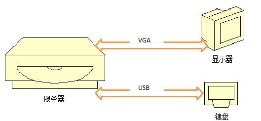
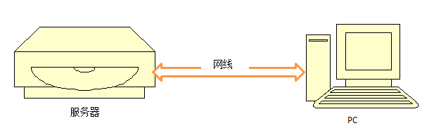

实验室有一台[浪潮服务器](http://www.inspur.com/lcjtww/443012/444624/447247/444653/450233/458433/index.html)。师兄只留下了开机用户名和密码，和一个`VMware vSphere Client`的安装包，就把它托付给了我。就是这样一个方方正正的长方体，只提供了接口，外设都要自己弄。当时也捅咕了一阵子，不过现在看来特别简单。  

### 服务器端
> - 接外设。这是服务器的外设示意图：  
  
> - 按下开机键。经过漫长等待后，显示器出现画面。然后机器进行一系列自检。  
> - 自检结束后，会显示Vmware版本、机器型号、硬件配置、IP地址等信息。 
> - 按F2键，进入登录窗口。  
> - 输入用户名与密码。假设是用户名`root`，密码`zhangsan123`。  
> - 成功登入服务器后，显示`System Customization`界面。  
> - 在`Configure Management Network`选项中，找到并记录IP配置，我的机器是： 
> > - IPv4地址:`172.16.1.6`  
> > - 子网掩码Mask:`255.255.0.0`  
> > - 网关：Gateway:`172.16.1.1`  
> > - 很显然，这是一个内网IP。你的地址可能与它不同。

### PC端
> - 按照如下拓扑图，用网线连接PC和服务器。  
  
服务器和PC并不是一定要用网线直接互连的。也可以将二者分别接入局域网，甚至不同的网关下。只要能ping通即可。
> - 设置IPv4地址，如下：
> > - IP：172.16.1.60
> > - 子网掩码：255.255.0.0  
> > - 默认网关留空
> > - DNS服务器地址留空
> > - 我这样配置，只是为了保证PC与服务器在同一网段内。当然，你要根据你的环境去配置IP，只要能ping通即可。  
> - 安装`VMware vSphere Client`，或者`VMware Workstation`。
> > - 前者可以对服务器做全方面的管理，后者只能使用住在服务器里的各个虚拟机。我的需求并不高，所以更常用Workstation。  
> > - 注意，vSphere Client必须与服务器VMware版本**对应**。如果你不知道什么版本，浏览器访问`http://服务器ip`，弹出的欢迎页中可以找到该版本vSphere Client的下载链接。  
> > - Workstation的版本就都可以了，我用的是Workstation 10。不一定是最新版，我曾在Win10上装了Workstation 12 Pro，发现连服务器时总出错，就换回了Workstation 10。  
> - 启动VMware vSphere Client。或者启动WorkStation，点击：`文件->连接服务器`。 
> - 输入服务器的IP地址、用户名、密码。  
> - 点击`登陆`/`连接`，可能弹出一个对话框，大意是“这台服务器的证书我不认识。你要继续冒这个险吗？”。选择确认或继续，无视就可以了  。
> - 如果配置正确，即可连接到服务器。按照需求，管理不同的虚拟机。

### 关机  
这台服务器工作时噪声很大，小小的实验室不允许它24小时开机。关机按照服务器端显示器的提示操作，一般是：  
> - 按下ESC退出登录  
> - 按下F12，即`Shut Down/Restart`  
> - 在弹出的确认框中，输入密码  
> - 按照提示，选择关机还是重启  

### 安装vSphere Client遇到的问题
我在Win10上安装vSphere Client，曾遇到了这样的问题：
>此产品只能安装在 Windows XP SP2 及更高版本上

**解决方法**：

> - 右键单击 VMware-viclient-build number.exe 文件，然后单击属性。 

> - 在`兼容性`选项卡上，选择`在兼容模式下运行此程序:`，然后从列表中选择 `Windows 7`。 

> - 单击`确定`。 

> - 运行 VMware-viclient-build number.exe 文件。

> - 安装时的选项都选择默认。另外，**不要更改默认的安装路径**。